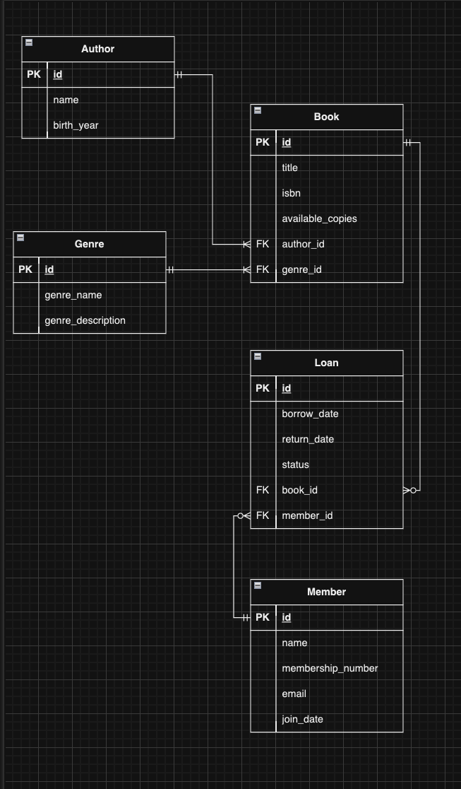

# **Library Management System (LMS) API**

A simple but robust API used to manage a Library's operations. This includes books, members and loans. This system streamlines library management in a sense of tracking available books, member details, and loan records.

---

## Table of Contents
- [Purpose](#purpose)
- [Features](#features)
- [System Requirements](#system-requirements)
- [Installation](#installation)
  - [Setting up the Virtual Environment (venv)](#setting-up-the-virtual-environment-venv)
  - [Activating the Virtual Environment](#activating-the-virtual-environment)
  - [Installing the Required Packages](#installing-the-required-packages)
- [How to Run the API](#how-to-run-the-api)
- [Required Packages](#required-packages)
- [Licensing and Legal/Ethical Impacts](#licensing-and-legalethical-impacts)
   - [License Overview](#license-overview)
   - [Full MIT License Text](#full-mit-license-text)
   - [Ethical Considerations](#ethical-considerations)
- [Explanation of Chosen Database System](#explanation-of-chosen-database-system)
   - [Key Features of RDBMS](#key-features-of-rdbms)
   - [Comparison to Other Database Systems](#comparison-to-other-database-systems)
   - [Entity Relationship Diagram](#entity-relationship-diagram)
   - [Conclusion](#conclusion)
- [Credits](#credits)


## **Purpose**

This Library Management System (LMS) is designed to simplify the administrative tasks of librarians. It allows staff to effeciently manage book collections, member data, loan records and streamlines proccesses for efficiency.


## **Features**

- **Book Management:** Add, update, delete and search for books or authors.

- **Member Management:** Manage library member records.

- **Loan Tracking:** Monitor active loans by their borrow and return dates.

- **Real-Time Availablility:** Automatically update available copies when books are borrowed.

- **Database Integration:** Uses SQLAlchemy for robust database management.


## **System Requirements**

- **Python Version:** 3.9.6 or later  
- **Database:** PostgreSQL recommended  
- **Operating System:** Windows, macOS, or Linux


## **Installation**

### **Setting up the Virtual Environment (venv)**

1. Open your terminal or command prompt.
2. Navigate to your project directory:
   ```bash
   cd /path/to/your/project
   ```

### Create a Virtual Environment

```bash
python -m venv venv
```

### Activating the Virtual Environment

- **Windows:**
  ```bash
  venv\Scripts\activate
  ```
- **macOS/Linux:**
  ```bash
  source venv/bin/activate
  ```


### Installing the Required Packages

Once the virtual environment is activated, install the necessary packages:

```bash
pip install -r requirements.txt
```

Alternatively, install each package individually:

```bash
pip install blinker==1.9.0 click==8.1.7 Flask==3.1.0 flask-marshmallow==1.2.1 Flask-SQLAlchemy==3.1.1 greenlet==3.1.1 importlib_metadata==8.5.0 itsdangerous==2.2.0 Jinja2==3.1.4 MarkupSafe==3.0.2 marshmallow==3.23.1 marshmallow-sqlalchemy==1.1.0 packaging==24.2 psycopg2==2.9.10 python-dotenv==1.0.1 SQLAlchemy==2.0.36 typing_extensions==4.12.2 Werkzeug==3.1.3 zipp==3.21.0
```


### How to Run the API

1. Ensure your virtual environment is activated.
2. Start the API server:
   ```bash
   flask run
   ```
3. Access the API at `http://localhost:8080`.

---


## Required Packages

- **blinker:** 1.9.0  
- **click:** 8.1.7  
- **Flask:** 3.1.0  
- **flask-marshmallow:** 1.2.1  
- **Flask-SQLAlchemy:** 3.1.1  
- **greenlet:** 3.1.1  
- **importlib_metadata:** 8.5.0  
- **itsdangerous:** 2.2.0  
- **Jinja2:** 3.1.4  
- **MarkupSafe:** 3.0.2  
- **marshmallow:** 3.23.1  
- **marshmallow-sqlalchemy:** 1.1.0  
- **packaging:** 24.2  
- **psycopg2:** 2.9.10  
- **python-dotenv:** 1.0.1  
- **SQLAlchemy:** 2.0.36  
- **typing_extensions:** 4.12.2  
- **Werkzeug:** 3.1.3  
- **zipp:** 3.21.0  

---


## Licensing and Legal/Ethical Impacts

### License Overview

### Key Points of the MIT License:
- **Permission:** You are permitted to use, copy, modify, merge, publish, distribute, sublicense, and/or sell copies of the software.
- **Attribution:** You must include the original copyright notice and the MIT License text with any distribution.
- **Warranty Disclaimer:** The software is provided "as is," without warranty of any kind. The authors are not liable for any damages or issues arising from the use of the software.

### Full MIT License Text:

```
MIT License

Copyright (c) 2024 Evan Meehan

Permission is hereby granted, free of charge, to any person obtaining a copy
of this software and associated documentation files (the "Software"), to deal
in the Software without restriction, including without limitation the rights
to use, copy, modify, merge, publish, distribute, sublicense, and/or sell
copies of the Software, and to permit persons to whom the Software is
furnished to do so, subject to the following conditions:

The above copyright notice and this permission notice shall be included in all
copies or substantial portions of the Software.

THE SOFTWARE IS PROVIDED "AS IS", WITHOUT WARRANTY OF ANY KIND, EXPRESS OR
IMPLIED, INCLUDING BUT NOT LIMITED TO THE WARRANTIES OF MERCHANTABILITY,
FITNESS FOR A PARTICULAR PURPOSE AND NONINFRINGEMENT. IN NO EVENT SHALL THE
AUTHORS OR COPYRIGHT HOLDERS BE LIABLE FOR ANY CLAIM, DAMAGES OR OTHER
LIABILITY, WHETHER IN AN ACTION OF CONTRACT, TORT OR OTHERWISE, ARISING FROM,
OUT OF OR IN CONNECTION WITH THE SOFTWARE OR THE USE OR OTHER DEALINGS IN THE
SOFTWARE.
```

### Ethical Considerations

The LMS API should be used responsibly, adhering to legal and ethical standards:
- **Data Privacy:** Ensure that sensitive information, such as user data and borrowing history, is securely handled and stored.
- **Compliance:** Follow local laws and regulations when deploying and using the system.
- **Community Impact:** Promote responsible usage in educational and public institutions to benefit communities without causing harm or bias.

---

For more information about licensing, visit [Open Source Initiative](https://opensource.org/licenses/MIT).


## Explanation of Chosen Database System

The database system I have chosen for this Library Management System (LMS) is a **Relational Database Management System (RDBMS)**. 

### Key Features of RDBMS:

**Structured Data Storage:**  
Data is stored within tables (relations) with rows and columns. Each table represents a different entity. In my case, I have tables for **Author**, **Genre**, **Book**, **Member**, and **Loan**. Each row within these tables represents a record.

**Primary and Foreign Keys:**  
- **Primary Keys (PK):** These keys ensure each record is unique.  
- **Foreign Keys (FK):** These keys establish relationships between tables, making it easy to connect different entities.

**Normalization:**  
Normalization reduces redundancy by organizing data into tables based on related entities. This ensures data is easily updated, consistent, and avoids duplication.

**SQL (Structured Query Language):**  
RDBMS use SQL to query, manipulate, and manage data. SQL is also used for creating and retrieving records, and defining relationships between records. For this assignment, I will be using **PostgreSQL**.

**ACID Properties:**  
ACID (Atomicity, Consistency, Isolation, Durability) properties guarantee that transactions are reliable and prevent data corruption.

---


### Comparison to Other Database Systems:

**Relational Database vs. NoSQL Database:**  

- **Structure:**  
  RDBMS store data within structured tables, whereas NoSQL databases store data in flexible, unstructured formats like graphs, dictionaries, or documents.  

- **Schema:**  
  RDBMS require a predefined schema with strict relationships. NoSQL databases do not have a schema and allow for dynamic data models.  

- **Scalability:**  
  RDBMS scale vertically, meaning more power is added to a single server. NoSQL databases scale horizontally, adding more servers to the system.  

- **Use Case:**  
  NoSQL is often used for large-scale applications, while RDBMS are generally used for structured data with fixed relationships.  

---


## **Entity Relationship Diagram:**




### Conclusion:
For the Library Management System, a **relational database** is the optimal choice. It provides a solid foundation for managing structured data, ensuring clear relationships between entities, maintaining data integrity, and supporting complex queries.


## Credits

Created by Evan Meehan.  
Contributions and guidance from Coder Academy educators.

